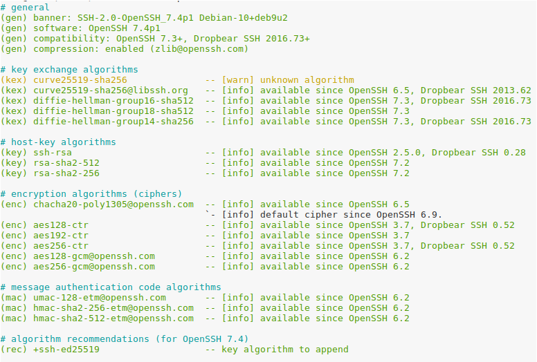
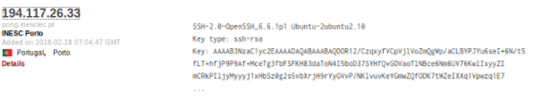
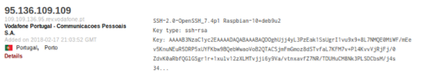
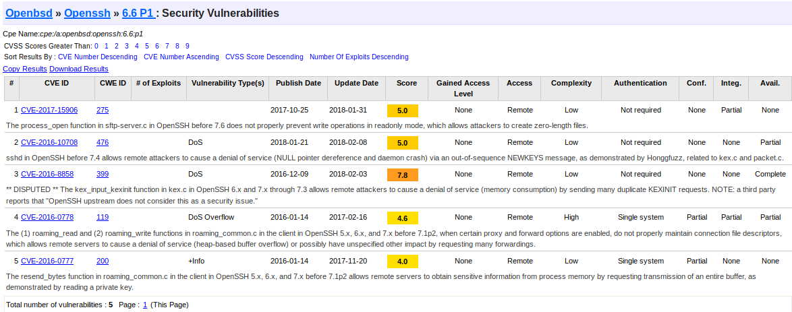
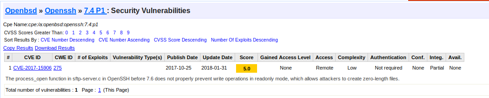

# 3. Protocolo SSH
Grupo 5 - Escolha dois servidores ssh de empresas comerciais no Porto.

## Experiência 3.1

Este servidor utiliza o software OpenSSH versão 7.4p1

Os algoritmos de troca de chave, de chave pública, de cifra e MAC estão atualizados e são adequados,

## Pergunta p3.1

### Servidores escolhidos:
A:

Servidor do Insectec

B:

Servidor da Vodafone

### 1 - Anexe os resultados do ssh-audit à sua resposta.
A:

Comando utilizado:

`python ssh-audit.py pong.inesctec.pt > inesctec.txt`

[Inesctec](inesctec.txt)

B:

Comando utilizado:

`python ssh-audit.py 109.109.136.95.rev.vodafone.pt > Vodafone.txt`

[Vodafone](Vodafone.txt) 

### 2 - Indique o software e versão utilizada pelos servidores ssh.

A:

(gen) banner: SSH-2.0-OpenSSH_6.6.1p1 Ubuntu-2ubuntu2.10

(gen) software: OpenSSH 6.6.1p1

B:

(gen) banner: SSH-2.0-OpenSSH_7.4p1 Raspbian-10+deb9u2

(gen) software: OpenSSH 7.4p1

### 3 Qual dessas versões de software tem mais vulnerabilidades?
A:

B:

O software do servidor A é o que apresenta mais vulnerabilidades uma vez que apresenta 5 enquanto que o software utilizado no servidor B apenas apresenta uma vulnerabilidade conhecida de acordo com o site: www.cwe-mitre.org.

### 4 E qual tem a vulnerabilidade mais grave (de acordo com o CVSS score identificado no CVE details)?
O servidor A uma vez que apresenta uma vulnerabilidade com um score de 7.8.

### 5 Para efeitos práticos, a vulnerabilidade indicada no ponto anterior é grave? Porquê?
[CWE-2016-8858 CWE ID 399](https://www.cvedetails.com/cve/CVE-2016-8858/)

#### CVSS Score                     7.8

<space>               | <space>     | <space>
--------------------- | ----------- | -------------------------------------------------------------------------
Confidentiality Impact| None        | (There is no impact to the confidentiality of the system.)  
Integrity Impact      | None        | (There is no impact to the integrity of the system)
Availability Impact   | Complete    | (There is a total shutdown of the affected resource.The attacker can render the resource completely unavailable.)    
Access Complexity     | Low         | (Specialized access conditions or extenuating circumstances do not exist. Very little knowledge or skill is required to exploit. )      
Authentication        | Not required| (Authentication is not required to exploit the vulnerability.)

Sim de um ponto de vista prático esta vulnerabilidade é muito grave uma vez que pode causar uma falha completa do servidor, através de um ataque de DNS e não é preciso um conhecimento técnico muito grande para realizar esse ataque.

